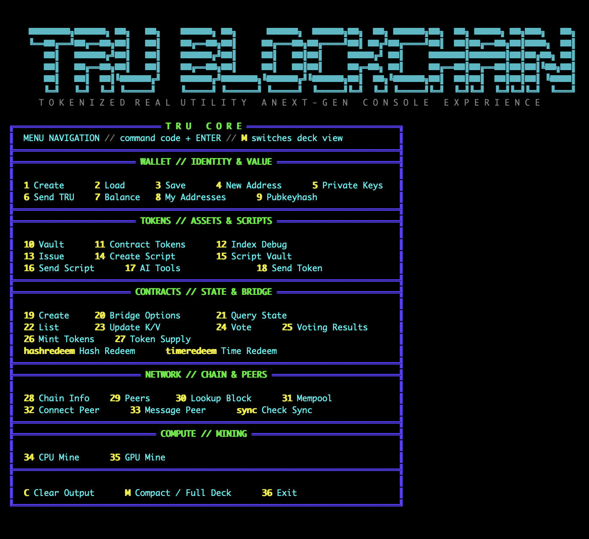
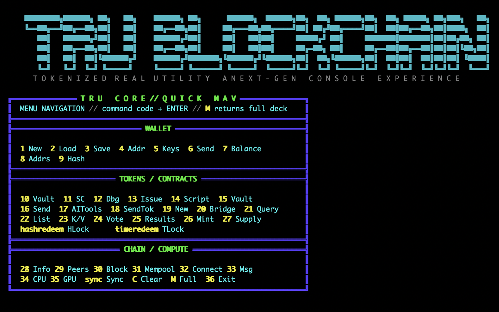

# TRU — Tokenized Real Utility

> **A UTXO-based Proof-of-Work Layer 1 combining Bitcoin-style ownership, stateful smart contracts, native tokenization, AI-oracle anchoring, Living Tokens, CPU/GPU mining, and a complete node / wallet / CLI / explorer stack.**

TRU is an independent Layer-1 blockchain written in C++17. The chain is internally known as **TRU**, its native asset is **TRU**, and the project is focused on **Tokenized Real Utility**: bringing ownership, programmable assets, verifiable state, real-world data workflows, and AI-assisted applications together on one UTXO-based network.

TRU is not an ERC-20 token, sidechain, or cosmetic Bitcoin fork. It implements its own blockchain node, Proof-of-Work validation, UTXO ledger, mempool, P2P networking, mining, wallet, script interpreter, token layer, AI-oracle subsystem, JSON-RPC API, command-line tools, and block explorer.

## TRU — PUBLIC SOFTWARE AND NETWORK NOTICE

TRU is blockchain software for operating and participating in the
Tokenized Real Utility network.

This initial release is provided free of charge.

The TRU project is not selling TRU, conducting an ICO, presale,
SAFT, crowdfunding token sale, or soliciting investment in TRU.

No purchase from the project is required to operate a node,
participate in the network, or mine according to the protocol.

TRU does not provide equity, ownership in a company, dividends,
revenue sharing, guaranteed yield, redemption rights, or contractual
rights to business profits.

Initial distribution:

Genesis premine:        NONE
Founder allocation:     NONE
Treasury allocation:    NONE
Investor allocation:    NONE
ICO / presale:          NONE
Protocol distribution:  PROOF-OF-WORK

Native TRU units are created according to the protocol-defined
Proof-of-Work block reward.

Following public network activation, the project's developer may
participate in mining using the same publicly available software,
Proof-of-Work algorithm, difficulty rules, and block rewards available
to other network participants.

The project makes no promise or representation regarding future
monetary value, market price, exchange listing, liquidity, or
investment return.

TRU is provided for software development, computation, network
participation, tokenization, smart-contract, and other technical uses.

Users are responsible for compliance with laws applicable to them
and their jurisdiction.

---

### Public Launch Record

Public announcement: 9-12-2026
Network activation:  9-12-2026

Node image:
ghcr.io/agreatopportunity/tru-node:2.0.2

Immutable image digest:
sha256:b2d0dc79b4f690fd8d65a5bb8ee9647120d66023474e1d82c7af134d1345e3ac

Genesis hash:


Initial block reward:
50 TRU

Mining:
Public Proof-of-Work
No reserved founder or project mining reward

## Highlights

- **UTXO-based Layer 1** with Bitcoin-style inputs, outputs, P2PKH/P2SH, transaction IDs, Merkle roots, and cumulative-work fork choice.
- **Nakamoto Proof-of-Work** using TRU's `SHA256d + 21E8` puzzle.
- **60-second target block time** with deterministic difficulty calculation derived from the parent chain.
- **CPU and OpenCL GPU mining** using the same consensus puzzle as the node validator.
- **Large-block architecture** with size-aware block assembly, P2P headroom, and a reusable block-size configurator.
- **Stateful UTXO smart contracts** with persistent contract storage and gas metering.
- **Real ECDSA single-signature and multisignature verification** over secp256k1.
- **Four native token classes**: FT, NFT, SFT, and NCFT.
- **TRUSCRIPT inscriptions** for on-chain text/data ownership.
- **Living Token Evolution** with cryptographically linked AI-generated metadata epochs.
- **Provider-agnostic AI oracle** supporting local, private, cloud, and custom AI backends.
- **AI responses and evolution proofs anchored on-chain** without making nondeterministic AI execution part of consensus.
- **Interactive terminal UI** with responsive full/compact menus and live mining information.
- **Standalone `tru-cli`** with Bitcoin-style commands plus raw access to the full JSON-RPC API.
- **HD/BIP32 wallet core**, terminal wallet functionality, and Qt desktop GUI support.
- **HTTP block explorer** and a broad JSON-RPC interface.
- **Docker deployment** for nodes and miners.

---

## Table of Contents

1. [Chain Parameters](#chain-parameters)
2. [Architecture](#architecture)
3. [Consensus and Proof-of-Work](#consensus-and-proof-of-work)
4. [Large-Block Architecture](#large-block-architecture)
5. [Transactions and UTXOs](#transactions-and-utxos)
6. [Smart Contracts and Opcodes](#smart-contracts-and-opcodes)
7. [Native Token System](#native-token-system)
8. [TRUSCRIPT Inscriptions](#truscript-inscriptions)
9. [AI Oracle](#ai-oracle)
10. [Living Token Evolution](#living-token-evolution)
11. [Interactive Node CLI](#interactive-node-cli)
12. [`tru-cli`](#tru-cli)
13. [Wallets](#wallets)
14. [Mining](#mining)
15. [P2P Networking](#p2p-networking)
16. [Storage](#storage)
17. [JSON-RPC API](#json-rpc-api)
18. [Block Explorer](#block-explorer)
19. [Building and Running](#building-and-running)
20. [Docker](#docker)
21. [Configuration](#configuration)
22. [Implementation Status](#implementation-status)
23. [Security Notes](#security-notes)
24. [Scaling Direction](#scaling-direction)
25. [Additional Documentation](#additional-documentation)

---

# Chain Parameters

| Parameter | Current design |
|---|---|
| Chain | Tokenized Real Utility |
| Native asset | TRU |
| Model | UTXO |
| Consensus | Nakamoto Proof-of-Work |
| PoW | `SHA256d + 21E8` |
| Base unit | 1 TRU = 100,000,000 Atoms |
| Initial block subsidy | 50 TRU |
| Halving interval | 210,000 blocks |
| Target block time | 60 seconds |
| Difficulty retarget interval | 60 blocks |
| Retarget adjustment clamp | 0.5× to 2× target movement per interval |
| Coinbase maturity | 100 blocks |
| Maximum supply | 21,000,000 TRU |
| Address format | Base58Check P2PKH |
| Default RPC port | 21832 |
| Default P2P port | 21833 |
| Default explorer port | 8001 |

### Current staged large-block profile

The large-block infrastructure centralizes block and network sizing so miners, validation, templates, and P2P transport stay aligned.

| Limit | Staged value |
|---|---:|
| Hard consensus block cap | **64 MiB** |
| Miner/template assembly budget | **56 MiB** |
| P2P framed payload cap | **80 MiB** |

The assembly budget intentionally sits below the consensus cap so the block builder has room for block-level metadata and serialization overhead.

TRU also includes a reusable `Block_Size_Increaser_or_Decreaser_Patch.py` utility for future controlled size changes. Under the current 32-bit P2P Frame V1 design, the utility supports configurations up to **3 GiB** while preserving transport headroom.

> **Consensus note:** the maximum accepted block size is a consensus rule. All participating nodes should be upgraded before miners begin producing blocks larger than the previous limit. Lowering the limit also requires care if historical blocks already exceed the proposed new cap.

A future P2P Frame V2 / streamed-block architecture is required before safely moving to true 4 GiB+ or effectively unbounded blocks.

---

# Architecture

TRU runs as a complete blockchain stack rather than depending on another chain for settlement.

```text
                         +----------------------+
                         |  Interactive CLI     |
                         |  Qt GUI / tru-cli    |
                         +----------+-----------+
                                    |
          +-------------------------+-------------------------+
          |                                                   |
+---------v---------+                              +----------v---------+
| CPU / GPU Miners |                              | JSON-RPC Clients   |
+---------+---------+                              +----------+---------+
          |                                                   |
          +--------------------+------------------------------+
                               |
                     +---------v----------+
                     |      TRU NODE      |
                     |    tru_advanced    |
                     +---------+----------+
                               |
        +----------------------+----------------------+
        |                      |                      |
+-------v-------+      +-------v-------+      +-------v-------+
| Blockchain / |      |    Mempool    |      |  Script VM /  |
| Fork Choice  |      | TX Admission  |      | Smart Contract|
+-------+-------+      +-------+-------+      +-------+-------+
        |                      |                      |
        +----------------------+----------------------+
                               |
                +--------------+--------------+
                |                             |
        +-------v-------+             +-------v-------+
        | UTXO / State |             |   AI Oracle   |
        |   LevelDB    |             | Provider Hub  |
        +-------+-------+             +-------+-------+
                |                             |
                +--------------+--------------+
                               |
                        +------v------+
                        | P2P Network |
                        |  Protobuf   |
                        +-------------+
```

Major modules include:

- `blockchain` — validation, cumulative work, reorganization, difficulty, subsidy, UTXO application.
- `mempool` — transaction admission, conflict handling, double-spend protection, relay policy.
- `script_interpreter` — Bitcoin-style stack execution plus TRU's extended opcodes.
- `utxo` / storage — persistent UTXOs, contract state, token metadata, integrity checks.
- `tx` — transaction structures, serialization, signing, and sighash.
- `p2p`, `peer_connection`, `message_handler` — peer networking and message transport.
- `wallet` — HD keys, addresses, balances, transaction construction, token issuance and transfer.
- `rpc_server` — JSON-RPC control and application interface.
- `ai_oracle_service`, `ai_providers` — provider-neutral AI requests and on-chain commitments.
- `blockexplorer` — HTTP blockchain explorer.
- `tru-cli` — standalone RPC command-line client.

---

# Consensus and Proof-of-Work

TRU follows Nakamoto consensus: the valid chain with the **greatest cumulative Proof-of-Work** wins.

## SHA256d + 21E8

The TRU block header is double-SHA256 hashed. TRU's `21E8` rule is then applied consistently by:

- the node validator,
- the CPU miner,
- the OpenCL GPU miner.

A block hash must satisfy the compact target encoded in the block header's `bits` field.

## Block validation

Before a block is committed, TRU validates areas including:

- block/header structure,
- Proof-of-Work,
- parent block and height,
- timestamp and Median Time Past rules,
- Merkle root,
- coinbase placement and reward,
- transaction inputs and referenced UTXOs,
- same-block double spends,
- coinbase maturity,
- script execution,
- output/value bounds,
- expected difficulty,
- maximum serialized block size.

## Difficulty

Difficulty is derived deterministically from the parent chain so miners and validators calculate the same expected value.

The active retarget path uses:

```text
Target spacing:    60 seconds
Retarget interval: 60 blocks
```

Retarget movement is clamped to avoid sudden extreme changes. The compact-target calculation preserves the full 256-bit target scale used by mining and validation.

## Fork choice

Each indexed block carries cumulative chain work. TRU can identify a common ancestor and reorganize when a competing valid branch contains strictly more accumulated Proof-of-Work.

---

# Large-Block Architecture

TRU's scaling direction is **larger L1 capacity without abandoning deterministic validation**.

The large-block path coordinates three separate limits:

```text
Mempool
   |
   v
Size-aware transaction selection
   |
   v
Miner/template budget
   |
   v
Candidate block
   |
   v
Hard consensus block-size validation
   |
   v
P2P payload / relay capacity
   |
   v
Network peers
```

The block builder does not blindly copy an arbitrarily large mempool into a candidate block. Transaction selection stops at the configured assembly budget, leaving remaining transactions in the mempool for later blocks.

The P2P limit is kept above the consensus block cap so a valid large block is not accepted locally but rejected by the network transport layer.

### Reusable block-size configuration

After the large-block infrastructure is installed, the block size can be deliberately adjusted with:

```bash
python3 Block_Size_Increaser_or_Decreaser_Patch.py --show
python3 Block_Size_Increaser_or_Decreaser_Patch.py --preset 1GB
python3 Block_Size_Increaser_or_Decreaser_Patch.py --preset 2GB
python3 Block_Size_Increaser_or_Decreaser_Patch.py --preset 3GB
```

Arbitrary sizes are also supported within the current transport design:

```bash
python3 Block_Size_Increaser_or_Decreaser_Patch.py --set-mib 512
python3 Block_Size_Increaser_or_Decreaser_Patch.py --set-gib 1.5
```

A block-size increase is not a claim that the node has benchmarked that sustained throughput. Large-block production still depends on validation speed, storage, memory use, propagation, disk I/O, and peer capacity.

---

# Transactions and UTXOs

TRU transactions use the familiar Bitcoin-style model:

```text
Inputs
  -> previous txid + output index
  -> unlocking script

Outputs
  -> amount
  -> locking script
```

Standard spending uses compressed secp256k1 public keys and P2PKH-style scripts.

Supported relay/output patterns include:

- P2PKH
- P2SH
- `OP_RETURN`
- token outputs
- TRUSCRIPT data
- allow-listed smart-contract patterns

Transaction IDs are calculated from serialized transaction bytes using double SHA-256. Transactions received from peers are independently re-hashed and validated rather than trusting a peer-supplied transaction ID.

---

# Smart Contracts and Opcodes

TRU extends Bitcoin-style scripting with persistent state, gas accounting, deterministic chain-state access, modern hashes, and token/bridge primitives.

## Signature operations

The live interpreter supports real ECDSA validation for:

- `OP_CHECKSIG`
- `OP_CHECKSIGVERIFY`
- `OP_CHECKMULTISIG`
- `OP_CHECKMULTISIGVERIFY`

Multisig enforces signature/public-key bounds and performs ordered M-of-N verification.

## Stateful execution

TRU's contract execution context can include:

- transaction and input context,
- sender/caller,
- contract address,
- execution height,
- gas limit and gas used,
- persistent contract state,
- deterministic chain context,
- callback hooks.

Important state and control opcodes include:

| Opcode | Purpose | Status |
|---|---|---|
| `OP_BLOCKTIME` | Current block time | Implemented |
| `OP_CHAINSTATECHECK` | Deterministic chain-state read | Implemented |
| `OP_HASHBLAKE2B` | BLAKE2b-256 | Implemented |
| `OP_SHA3` | SHA3-256 | Implemented |
| `OP_STORE` | Persist contract key/value | Implemented |
| `OP_LOAD` | Read contract key/value | Implemented |
| `OP_CALLER` | Push sender address | Implemented |
| `OP_CONTRACT_ADDR` | Push contract address | Implemented |
| `OP_GAS` | Remaining execution gas | Implemented |
| `OP_HALT` | Halt execution | Implemented |
| `OP_REVERT` | Revert execution/state | Implemented |
| `OP_OUTPUTAMOUNT` | Current output amount | Implemented |
| `OP_MINT_TOKEN` | Mint contract tokens | Implemented |
| `OP_TOKEN_BALANCE` | Contract token balance | Partial |
| `OP_BURN_TOKEN` | Burn contract tokens | Partial |
| `OP_EXTERNALDATA` | Generic external-data opcode | Placeholder |
| `OP_DATAFEED` | Generic keyed data-feed opcode | Placeholder |
| `OP_DELEGATECHECK` | Delegate/trusted signature | Stub |
| NOVO bridge opcodes | Wrapped NOVO bridge path | Scaffold |
| BSTY bridge opcodes | Wrapped BSTY bridge path | Scaffold |

### Gas

Contract execution is metered. Operations consume different amounts of gas based on complexity, protecting the interpreter from unbounded script execution.

### Deterministic chain state

`OP_CHAINSTATECHECK` reads deterministic values relative to the block being validated, including values such as:

- block height,
- total issued supply,
- block subsidy.

It fails closed when deterministic chain context is unavailable.

---

# Native Token System

TRU provides four first-class token categories.

| Type | Name | Characteristics | Example use |
|---|---|---|---|
| **FT** | Fungible Token | Divisible, configurable supply | currency, rewards, utility |
| **NFT** | Non-Fungible Token | Unique, amount = 1 | ownership, collectibles, real assets |
| **SFT** | Sentient Fungible Token | Fungible/evolving AI-oriented metadata | AI-assisted assets, limited editions |
| **NCFT** | Neural Canvas Fungible Token | Dynamic media / AI-oriented metadata | evolving art, media, digital experiences |

Token transactions combine:

- UTXO funding,
- an ownership script,
- structured token metadata,
- transaction signing,
- mempool/network relay,
- persistent metadata and ownership tracking.

Wallet issuance functions include:

```text
issueExtendedFT
issueExtendedNFT
issueExtendedSFT
issueExtendedNCFT
```

Token metadata can include names, symbols, descriptions, media URLs, divisibility, unique IDs, dynamic visual information, and AI-oriented fields depending on token type.

---

# TRUSCRIPT Inscriptions

TRUSCRIPT provides ordinal-style text/data inscriptions on TRU.

The system tracks information such as:

- inscription identity,
- inscription index,
- sat number,
- timestamp,
- current ownership,
- transfers.

Wallet and RPC functionality can create, list, inspect, and transfer TRUSCRIPT assets.

---

# MagicMiner and MagicLock

TRU includes a native **MagicLock** transaction type and a companion **MagicMiner** tool. MagicLock combines ordinary UTXO ownership with a second computational condition: before the locked TRU can be spent, the owner must produce a valid ECDSA signature whose double-SHA256 hash begins with a chosen hexadecimal prefix.

This is separate from TRU block mining. **MagicMiner does not mine blocks or change chain difficulty.** It performs *signature grinding* for a specific MagicLock UTXO while normal TRU Proof-of-Work continues independently.

## How a MagicLock works

When a MagicLock is created, the wallet constructs a locking script with two requirements:

```text
                    MAGICLOCK UTXO
                         |
          +--------------+--------------+
          |                             |
          v                             v
  HASH256(signature)             Standard P2PKH
  must begin with                ownership check
  target prefix                  + ECDSA CHECKSIG
          |                             |
          +--------------+--------------+
                         |
                         v
                  UTXO may be spent
```

The canonical locking script is built as:

```text
OP_SWAP
OP_HASH256
<N>
OP_LEFT
<TARGET_PREFIX>
OP_EQUALVERIFY
OP_DUP
OP_HASH160
<OWNER_PUBKEY_HASH>
OP_EQUALVERIFY
OP_CHECKSIG
```

The first half checks the computational target. The second half preserves normal P2PKH ownership, meaning the spender must still possess the private key belonging to the address that created the MagicLock.

A MagicLock therefore does **not** turn the locked TRU into a public bounty that anyone can claim simply by finding a matching hash. The matching signature must also be a valid ECDSA signature from the lock owner's key.

## Creating a MagicLock

The `createmagiclock` RPC accepts:

```text
amount
targetPrefix
address          optional
secretData       optional
dataType         optional
```

The target must be a non-empty hexadecimal string with an even number of characters.

Example conceptual targets:

| Target | Prefix bytes | Expected signature attempts |
|---|---:|---:|
| `00` | 1 | ~256 |
| `21e8` | 2 | ~65,536 |
| `000000` | 3 | ~16.8 million |
| `00000000` | 4 | ~4.29 billion |

Each additional target byte increases expected work by approximately **256×**.

The wallet funds the MagicLock from a spendable TRU UTXO, creates the special locking output, returns change when appropriate, signs the creation transaction, places it in the mempool, and broadcasts it to peers.

## Unlocking: real signature grinding

To unlock a MagicLock, TRU:

1. Loads the locked UTXO.
2. Extracts the target prefix and the owner's public-key hash from the locking script.
3. Builds a spending transaction to the requested recipient.
4. Calculates the transaction sighash using the full MagicLock locking script.
5. Loads the private key belonging to the lock owner.
6. Repeatedly generates a random ECDSA nonce (`K`) and creates a valid signature.
7. Appends `SIGHASH_ALL`.
8. Computes `SHA256(SHA256(signature))`.
9. Checks whether the resulting hash begins with the MagicLock target prefix.
10. When a match is found, constructs the unlocking `scriptSig`, validates the transaction, adds it to the mempool, and broadcasts it.

The unlock script supplies the matching signature twice plus the public key:

```text
<signature>
<signature>
<public-key>
```

One signature copy is consumed by the prefix-hash condition and the other by the final `OP_CHECKSIG`.

The current C++ grinding routine is bounded to **1,000,000 attempts per unlock call**. As a result, one- and two-byte targets are practical with the present implementation, while targets whose expected search space is substantially larger than one million attempts may require additional engineering or repeated attempts.

## MagicMiner tool

The companion Node.js utility, currently implemented as:

```text
tru_magic_miner_new.js
```

provides an interactive interface for:

```text
1) Create MagicLock
2) Search MagicLocks
3) Unlock MagicLock
4) Change wallet address
5) Exit
```

It connects to the TRU node through JSON-RPC, normally on:

```text
127.0.0.1:21832
```

and uses the node RPC methods:

```text
createmagiclock
listmagiclocks
unlockmagiclock
listaddresses
```

`listmagiclocks` scans confirmed blocks and the mempool, identifies canonical and supported legacy MagicLock script patterns, and reports information including:

```text
txid
vout
amount
targetPrefix
owner address
block height
spent / unspent status
```

### Important implementation detail

The animated **"Mining & Flipping Hashes"** display in the JavaScript MagicMiner is a user-interface animation. The actual cryptographic signature grinding is performed by the TRU C++ wallet/node inside `unlockMagicLock()`.

The node extracts the real target from the UTXO and performs the ECDSA grind against that target before the spend can pass script validation.

## Optional attached data

A MagicLock creation request can optionally include small metadata or data in an `OP_RETURN` output. The current RPC path supports text or encoded file data and associates it with `MAGIC_SECRET` metadata.

This feature is presently best treated as **experimental attached-data functionality, not secure secret storage**.

The current RPC implementation derives the data key deterministically from the MagicLock target prefix and the owner's public-key hash and uses a simple XOR transformation for this path. Because both the target and public-key hash are visible in the MagicLock script, this mechanism should not be relied upon to keep sensitive information confidential until the unlock occurs.

A future hardened MagicLock secret system should use a true unlock-dependent secret, authenticated encryption, or another construction in which the decryption key cannot be derived solely from public on-chain values.

For larger documents or media, store the content externally and place only a cryptographic hash, content identifier, or encrypted reference on-chain.

## RPC examples

Create a MagicLock:

```bash
curl -sS \
  -H 'Content-Type: application/json' \
  --data '{
    "jsonrpc":"2.0",
    "id":1,
    "method":"createmagiclock",
    "params":{
      "amount":0.001,
      "targetPrefix":"21e8"
    }
  }' \
  http://127.0.0.1:21832/rpc
```

List MagicLocks:

```bash
curl -sS \
  -H 'Content-Type: application/json' \
  --data '{
    "jsonrpc":"2.0",
    "id":1,
    "method":"listmagiclocks",
    "params":{}
  }' \
  http://127.0.0.1:21832/rpc
```

Unlock one:

```bash
curl -sS \
  -H 'Content-Type: application/json' \
  --data '{
    "jsonrpc":"2.0",
    "id":1,
    "method":"unlockmagiclock",
    "params":{
      "txid":"<MAGICLOCK_TXID>",
      "vout":0,
      "recipient":"<TRU_ADDRESS>"
    }
  }' \
  http://127.0.0.1:21832/rpc
```

## Why MagicLock is different

A normal P2PKH TRU output asks one primary question:

```text
Can you prove ownership of this private key?
```

A MagicLock asks two:

```text
Can you prove ownership of this private key?

AND

Can you produce a valid transaction signature
whose HASH256 begins with the required target?
```

That gives TRU a native **proof-conditioned UTXO** primitive that can be used for experiments with computational locks, puzzles, delayed-effort spends, game mechanics, proof challenges, and other applications that combine ownership with configurable computational work.

---
# AI Oracle

TRU includes a **provider-agnostic AI oracle system**.

The important architectural decision is that **AI inference is not part of Proof-of-Work consensus**.

Different LLMs can produce different text. Requiring every validator to independently run an AI model would therefore make deterministic consensus unsafe.

TRU separates the two:

```text
AI request
   |
   v
Configured AI provider
   |
   v
AI computation off-chain
   |
   +----------------------+
   |                      |
   v                      v
Full response          SHA-256 commitment
storage                   |
                           v
                    OP_RETURN anchor
                           |
                           v
                     TRU blockchain
```

The blockchain validates the resulting TRU transaction normally. Nodes do not need access to the model that produced the response.

## Supported provider layer

The current provider abstraction includes:

### Local / private

- Nemotron
- Oobabooga
- Ollama
- custom JSON/OpenAI-compatible endpoints

### Cloud

- OpenAI
- Anthropic / Claude
- xAI / Grok
- Google Gemini

Provider selection can change without changing TRU consensus or the on-chain commitment format.

Secrets belong in environment variables or protected local configuration and should never be committed to the blockchain.

> The generic `OP_EXTERNALDATA` and `OP_DATAFEED` interpreter opcodes remain placeholders. They are separate from the implemented AI-oracle service and must not be confused with live deterministic consensus data feeds.

---

# Living Token Evolution

TRU's **Living Token Evolution** system allows supported tokens to evolve AI-assisted metadata while preserving a cryptographically linked history.

```text
Existing token state
       |
       v
Load latest epoch
       |
       v
AI provider
       |
       v
Generate next metadata state
       |
       v
Epoch N -> Epoch N+1
       |
       v
Hash previous + new metadata
       |
       v
Persist evolution record
       |
       v
Queue signed TRU anchor
       |
       v
Mempool
       |
       v
Mined block
       |
       v
On-chain evolution commitment
```

The entire generated document does not need to be placed in every block. A compact commitment can contain fields such as:

```text
TRU_EVOLVE_V1
tokenID
tokenType
epoch
provider
trigger
previous_metadata_hash
new_metadata_hash
```

This allows an evolving digital asset to retain a verifiable timeline while AI providers, models, or off-chain storage systems change over time.

Potential applications include:

- AI-assisted digital identities,
- evolving game assets,
- digital twins,
- tokenized equipment or property records,
- autonomous-agent identity/state,
- dynamic media,
- supply-chain state,
- auditable AI-generated asset histories.

---

# Interactive Node CLI

Run the node with:

```bash
./tru_advanced --cli
```

The node includes a responsive terminal interface rather than requiring raw RPC calls for everyday operation.

## Full and compact menus

The interface automatically chooses a layout that fits the terminal. Press:

```text
M
```

or:

```text
m
```

to toggle between **FULL** and **COMPACT** menu modes.

The menu uses absolute terminal positioning so it does not continually scroll or stack duplicate copies. Chain information, the TRU banner, command output, and mining dashboard occupy separate screen areas.

### Full menu



### Compact menu



### Interactive operations

The current menu exposes:

| Option | Function |
|---|---|
| 1 | Create new wallet |
| 2 | Load wallet |
| 3 | Save wallet |
| 4 / 4a | Generate address / view private keys |
| 5 | Send TRU |
| 6 | Check balance |
| 7 / 7a | CPU mine / GPU mine |
| 8 | View chain information |
| 9 | List peers |
| 10 | Lookup block by hash |
| 11 | Exit |
| 12 / 12a / 12b | Token and smart-contract token views |
| 13 | Issue FT/NFT/SFT/NCFT |
| 13a | Create TRUSCRIPT |
| 13b | List wallet TRUSCRIPT |
| 13c | Send TRUSCRIPT |
| 13d | Create AI tokens |
| 14 | Show wallet addresses |
| 15 | Send tokens |
| 16 | Connect to peer |
| 17 | Send peer message |
| 18 | Create smart contract |
| 18a | Get current pubkey hash |
| 18b | Bridge contract options |
| 19 | List mempool transactions |
| 20 / 20a | Query/list contract state |
| 21 | Vote on contract |
| 22 | View voting results |
| 23 | Mint contract tokens |
| 24 | Contract-token supply |
| `sync` | Check blockchain synchronization |
| `C` | Clear output |
| `M` | Toggle full/compact menu |

## Live mining dashboard

While mining is active, the terminal can display node-reported miner information including:

- mining state,
- current hashrate,
- blocks found,
- block reward,
- chain height,
- current difficulty,
- last miner report age,
- algorithm,
- animated activity indicator.

The CPU miner dashboard uses the actual difficulty bits from its current candidate instead of a hard-coded display value.

---

# `tru-cli`

TRU also includes a standalone **Bitcoin-style RPC command-line client**.

The interactive `--cli` menu and `tru-cli` serve different purposes:

```text
tru_advanced --cli
    -> operator-friendly interactive node interface

tru-cli
    -> scriptable command-line RPC client
```

Typical usage:

```bash
cd build-native/bin

./tru-cli getinfo
./tru-cli getbalance
./tru-cli getblockcount
./tru-cli getchaininfo
./tru-cli getconnectioncount
./tru-cli getpeerinfo
./tru-cli getrawmempool
```

Query another address:

```bash
./tru-cli getbalance <TRU_ADDRESS>
```

Remote node:

```bash
./tru-cli -rpcconnect=<NODE_IP> -rpcport=21832 getinfo
```

Read connection settings from a TRU config file:

```bash
./tru-cli -conf=./tru.conf getinfo
```

## Raw RPC passthrough

Friendly wrappers cover common commands, but `raw` can call any RPC method exposed by the node:

```bash
./tru-cli raw getblocktemplate
./tru-cli raw gettokenmetadata '{"tokenID":"example"}'
./tru-cli raw listunspent '{"address":"<TRU_ADDRESS>"}'
./tru-cli raw verifytokenbalance '{"address":"<TRU_ADDRESS>","tokenID":"example"}'
```

Useful options include:

```text
-rpcconnect=<ip>
-rpcport=<port>
-conf=<file>
-json
-timeout=<seconds>
-h / --help
```

---

# Wallets

TRU uses an HD wallet core with BIP32-style key derivation.

Wallet functionality includes:

- seed-derived addresses,
- Base58Check P2PKH addresses,
- balance and UTXO discovery,
- transaction construction,
- ECDSA transaction signing,
- local or RPC operation,
- token issuance and transfer,
- TRUSCRIPT creation and transfer,
- smart-contract creation,
- MagicLock create/unlock,
- external private-key import.

User interfaces include:

- the node's interactive CLI,
- wallet CLI functionality,
- a Qt desktop GUI,
- RPC access,
- `tru-cli` for node/RPC operations.

Protect wallet files and WIF/private-key material carefully.

---

# Mining

TRU supports both CPU and GPU Proof-of-Work mining.

## CPU

Example standalone CPU miner:

```bash
./tru_miner_cpu \
  --node-ip 127.0.0.1 \
  --node-port 21832 \
  --mineraddr <TRU_ADDRESS> \
  --threads 4
```

## GPU

TRU includes OpenCL GPU mining using the same SHA256d + 21E8 consensus puzzle validated by the node.

GPU mining requires:

- a compatible GPU,
- OpenCL runtime/headers,
- appropriate vendor drivers.

## Mining flow

```text
Node
  |
  | getblocktemplate
  v
Miner
  |
  | nonce search
  v
Valid PoW
  |
  | submitblock
  v
Node validation
  |
  v
P2P relay
```

Miners can report activity and hashrate to the node, allowing the interactive interface to show live mining information.

---

# P2P Networking

TRU peers communicate over TCP using checksummed, length-prefixed Protobuf messages.

Message families include:

- `VERSION` / `VERACK`
- `ADDR`
- `INV`
- `GETDATA`
- `BLOCK`
- `TX`
- `PING` / `PONG`
- `HEIGHT`
- `GET_BLOCK`
- `GET_HEIGHT`
- `BLOCK_NOT_FOUND`

The network layer includes:

- peer handshakes,
- block and transaction relay,
- height gossip and synchronization,
- local revalidation of incoming transactions,
- stale-peer timeouts,
- per-IP connection controls,
- blacklist/Sybil-protection facilities,
- checksummed payloads.

Large-message sending retries partial TCP `send()` results rather than assuming a single write transmits an entire large block.

The current P2P Frame V1 uses a 32-bit payload-length field. This is why 4 GiB+ block transport requires a future framing/streaming upgrade rather than only increasing a numeric block limit.

---

# Storage

TRU persists chain and application state in LevelDB.

Storage functionality includes:

- Snappy compression,
- LRU block caching,
- thread-safe database access,
- batched writes,
- prefix iteration,
- compaction,
- repair,
- integrity verification,
- per-value checksums.

UTXO records include the creation height and coinbase status needed to enforce maturity rules.

Contract state, token metadata, ownership data, inscriptions, and evolution records are stored through the same persistent storage layer where appropriate.

---

# JSON-RPC API

The node exposes JSON-RPC at:

```text
http://127.0.0.1:21832/rpc
```

Example:

```bash
curl -sS \
  -H 'Content-Type: application/json' \
  --data '{"jsonrpc":"2.0","id":1,"method":"getchaininfo","params":{}}' \
  http://127.0.0.1:21832/rpc
```

TRU exposes a broad RPC surface. Representative groups include:

## Chain and blocks

```text
getinfo
getchaininfo
getblockcount
getblock
getblockbyheight
getblocktemplate
submitblock
```

## Transactions and UTXOs

```text
sendrawtransaction
createrawtransaction
signrawtransactionwithkey
gettransaction
getrawtransaction
decoderawtransaction
gettxout
listtransactions
listunspent
getrawmempool
getmempooltransactions
```

## Wallet and addresses

```text
getbalance
getnewaddress
listaddresses
getaddresstransactions
```

## Tokens and inscriptions

```text
issuetoken
sendtoken
gettokenutxo
gettokenmetadata
verifytokenbalance
inscribeTRUScript
transferTRUScript
getTRUScripts
getTRUScriptDetails
```

## Contracts

```text
createsmartcontract
createcontracttransaction
getcontracts
createmagiclock
unlockmagiclock
listmagiclocks
```

## Mining

```text
startmining
registerminer
unregisterminer
getminerstatus
getallminers
reportmineractivity
```

## AI

```text
configureAIProvider
getAIProviders
createAIToken
interactWithAIToken
getAIResponse
getAITokenState
trainAIToken
```

## Identity / social

```text
createDID
createsocialpost
getDIDMapping
registerDIDSigned
```

## Network

```text
getpeerinfo
```

`tru-cli raw` can access methods that do not yet have a friendly CLI wrapper.

> **Security:** RPC currently has no built-in HTTP authentication. Keep port `21832` on loopback or behind a properly authenticated reverse proxy/firewall.

---

# Block Explorer

TRU includes an HTTP block explorer, normally on port:

```text
8001
```

Representative endpoints include:

```text
/api/stats
/api/blocks
/block/<hash>
/api/addresses
/api/transactions
/api/address/<address>
/api/transaction/<txid>
/api/tokens
/api/contracts
/api/miners
```

The explorer can run with the node or as a standalone explorer process against the configured TRU data environment.

---

# Building and Running

## Dependencies

Linux, 2 GB RAM minimum (plus swap), roughly 10 minutes.

```bash
./install-deps.sh          # once per machine
```

Installs the C++17 toolchain, CMake, OpenSSL, libsodium, LevelDB, Protobuf,
Boost, libcurl, libfmt, jsoncpp — then builds crc32c, ethash, libwally-core
and cxxopts from source. OpenCL is needed only for GPU mining; Qt only for
the desktop GUI.

Check without installing anything:

```bash
./install-deps.sh --check
```

**Deactivate conda first.** TRU's C++ build uses system packages only. An
active conda environment puts its own cmake, protobuf, leveldb and libstdc++
ahead of the system ones, producing link errors or a binary that runs on that
machine and nowhere else. Both scripts refuse to run while one is active.

## Build

```bash
cd ~/NEW_TRU
./agnostic_rebuild.sh
```

Binaries land in:

```text
build-native/bin/
```

**Use `agnostic_rebuild.sh`, not `rebuild.sh`.** `rebuild.sh` runs
`rm -rf build-native`, and a native wallet lives in `build-native/bin/`.
`agnostic_rebuild.sh` preserves the encrypted wallet set through
`~/.local/share/tru/wallet/` and restores it after the build.

Back up your wallet before any rebuild:

```bash
tar czf ~/tru-wallet-$(date +%F).tgz -C ~/NEW_TRU/build-native/bin \
  tru.dat.enc tru.dat.public wallet_seed.dat.enc
```

Binaries are produced under the native build output, typically:

```text
build-native/bin/
```

## Run the node

```bash
cd ~/NEW_TRU/build-native/bin

./tru_advanced \
  --datadir data/utxo \
  --cli \
  --rpcport 21832
```

With the explorer:

```bash
./tru_advanced \
  --datadir data/utxo \
  --cli \
  --rpcport 21832 \
  --enable-explorer \
  --explorer-port 8001
```

Useful node flags include options for:

- CLI / GUI mode,
- P2P enable/disable,
- seed behavior,
- explicit peers,
- config file,
- RPC bind address,
- explorer.

---

# Docker

TRU can run in containers with its dependencies packaged into the image.

The Docker documentation defines separate roles for:

| Image | Purpose |
|---|---|
| `tru-node` | TRU node |
| `tru-miner-cpu` | standalone CPU miner |
| `tru-miner-gpu` | OpenCL GPU miner |

Basic node example:

```bash
docker run -it --name tru-node \
  -p 21833:21833 \
  -v tru-data:/app/data \
  -v "$(pwd)/tru.conf:/app/tru.conf:ro" \
  tru-node:latest --cli
```

P2P port `21833` is the public peer port.

RPC port `21832` should **not** be exposed publicly.

When RPC must be reachable from the Docker host, bind the service appropriately inside the container but publish it only to host loopback, for example:

```text
127.0.0.1:21832:21832
```

Docker Compose profiles can run:

- node only,
- node + CPU miner,
- node + GPU miner.

See `README_DOCKER.md` for the full deployment and persistence guide.

---

# Configuration

TRU reads network and node configuration from `tru.conf`.

Example:

```ini
[network]
rpcbind=127.0.0.1
rpcport=21832
p2pPort=21833
listen=1
rpcMaxConnections=32
externalip=<PUBLIC_OR_LAN_IP>
addnode=<SEED_IP>:21833
```

Important parser behavior:

- avoid spaces after commas in peer lists,
- put comments on their own lines,
- current peer configuration expects IP addresses rather than hostnames.

AI-provider API keys should remain in environment variables rather than blockchain state or committed configuration files.

Oracle WIF/private-key material must be protected as wallet credentials.

---

# Implementation Status

TRU is a working independent blockchain, but the project intentionally distinguishes implemented functionality from incomplete scaffolding.

## Implemented core

- Proof-of-Work consensus
- UTXO validation and persistence
- cumulative-work fork choice and reorganizations
- deterministic difficulty validation
- CPU mining
- OpenCL GPU mining
- mempool admission and double-spend handling
- P2P transaction/block transport
- ECDSA signatures
- ECDSA multisig
- stateful contract storage
- gas metering
- deterministic chain-state reads
- SHA-256 / SHA3 / BLAKE2b-related script functionality
- FT / NFT / SFT / NCFT token issuance
- token ownership/metadata tracking
- TRUSCRIPT inscriptions and transfers
- AI provider registry
- AI request/response anchoring
- Living Token Evolution and evolution commitments
- HD wallet functionality
- interactive responsive node CLI
- standalone `tru-cli`
- JSON-RPC server
- block explorer
- Docker deployment support
- size-aware large-block assembly/relay infrastructure

## Partial / intentionally incomplete

- `OP_EXTERNALDATA` — placeholder generic external data
- `OP_DATAFEED` — placeholder generic data-feed values
- `OP_DELEGATECHECK` — stub
- `OP_TOKEN_BALANCE` — partial
- `OP_BURN_TOKEN` — partial
- NOVO/BSTY bridge opcodes — bridge scaffolding, not a live production bridge

These items should not be represented as completed production capabilities until their validation and trust models are finished.

---

# Security Notes

TRU is still an evolving independent chain and should be treated accordingly.

Current considerations include:

- The chain is primarily enforced by one codebase.
- It has not yet had the years of adversarial exposure of mature public blockchains.
- Independent security review and consensus reimplementation would strengthen production readiness.
- Consensus changes should be tested across multiple nodes before real value depends on them.
- Large-block settings must be coordinated network-wide.
- AI-provider API keys should never be written to chain state or committed to Git.
- Bridges require substantially more security review before production use.
- Very large configured block limits must not be confused with benchmarked sustainable throughput.

For public deployments:

```text
21833/tcp  P2P   -> may be public
21832/tcp  RPC   -> keep private / authenticated
8001/tcp  Explorer -> expose only as intended
```

Privileged Core JSON-RPC requires transport authentication.

Default RPC bind: 127.0.0.1
Default RPC port: 21832
Public P2P port: 21833

Direct browser access to privileged Core RPC is forbidden.
Browser applications use the restricted same-origin web gateway.
Core RPC credentials are never exposed to browser JavaScript.

Remote Core RPC requires explicit configuration and should be
protected by network/firewall controls in addition to RPC authentication.

---

# Scaling Direction

TRU's present architecture provides a foundation for substantially larger L1 blocks, but block size alone is not the end of scaling.

The next major performance areas are:

1. parallel validation of independent UTXO transactions,
2. more efficient signature-verification batching,
3. indexed mempool dependency/conflict handling,
4. streamed/chunked large-block propagation,
5. incremental decoding rather than giant in-memory payloads,
6. storage and state-access benchmarking,
7. multi-node propagation testing,
8. block validation benchmarks at progressively larger sizes,
9. P2P Frame V2 for 4 GiB+ transport,
10. continued fuzzing and adversarial testnet work.

TRU's UTXO model creates a natural path toward parallel validation because independent transactions that consume different UTXOs can be checked concurrently and committed deterministically.

The project should measure real throughput rather than advertise configured block capacity as TPS.

---

# Additional Documentation

```
./rebuild.sh
    → rebuild binaries
    → NEVER touch wallet
    → NEVER touch chain

./rebuild.sh --fresh-chain
    → preserve/enforce wallet backup
    → archive chain database
    → create empty chain database
    → NEVER touch encrypted wallet
```

More focused documentation is available in the repository:

| File | Purpose |
|---|---|
| `README_API.md` | JSON-RPC API reference |
| `README_DOCKER.md` | Docker/node/miner deployment |
| `README_OPCODES.md` | Script and opcode reference |
| `README_TOKENS.md` | FT/NFT/SFT/NCFT token documentation |
| `TRU_CLI_README.md` | `tru-cli`, `getinfo`, `getbalance`, raw RPC usage |

The top-level README is intended to describe the **current TRU system as a whole**. Feature-specific READMEs should be kept synchronized with the implementation as the protocol evolves.

---

# Project Direction

TRU is being developed around a specific idea:

> **Use a deterministic UTXO Proof-of-Work blockchain as the ownership and settlement layer for programmable real-world utility, native digital assets, and verifiable AI-assisted state.**

The objective is not to make AI itself determine consensus. Instead, TRU provides a deterministic chain where AI-generated activity, evolving token state, ownership, smart-contract execution, and cryptographic commitments can coexist without requiring every validating node to trust or reproduce the same model output.

That combination is the core of **Tokenized Real Utility**.

---

# Links

### Run a node

```bash
# CPU
docker pull ghcr.io/agreatopportunity/tru-node:v2.0.8

# NVIDIA GPU
docker pull ghcr.io/agreatopportunity/tru-node-gpu:v2.0.8
```

Full deployment guide: **[TRU-DOCKER](https://github.com/agreatopportunity/TRU-DOCKER)**

All published image versions:
[tru-node](https://github.com/users/agreatopportunity/packages/container/tru-node/versions) ·
[tru-node-gpu](https://github.com/users/agreatopportunity/packages/container/tru-node-gpu/versions)

### Network

| | |
|---|---|
| Block explorer | [tokenizedrealutility.com](https://tokenizedrealutility.com/) |
| Web wallet | [tokenizedrealutility.com/wallet.html](https://tokenizedrealutility.com/wallet.html) |

### Community

| | |
|---|---|
| Telegram | [t.me/TRUBLOC](https://t.me/TRUBLOC) |
| X | [@TRUBLOCKCHAIN](https://x.com/TRUBLOCKCHAIN) |
| Reddit | [r/TRUBLOC](https://www.reddit.com/r/TRUBLOC/) |
| Discord | [discord.gg/utFCQdSdC](https://discord.gg/utFCQdSdC) |
| Signal | [Join group](https://signal.group/#CjQKIIenthb40lSmT47CstsKTwKkNua3ecYfcD2Ajqw3N5A4EhC1thDa8b4Cw9MofM2OT9tv) |

Issues and pull requests are welcome on this repository.

---

**TRU — Tokenized Real Utility**
*UTXO ownership. Proof-of-Work settlement. Stateful contracts. Native assets. Verifiable AI evolution.*
